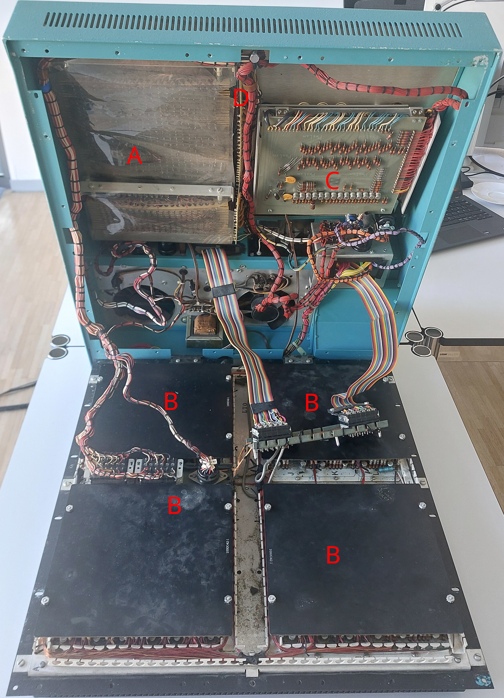

The internal construction of the Mathatron is divided into two sections. The top part of the case behind the printer
assembly contains the power supply, the core drivers, and some circuitry related to the printer. The interior of the
main part of the machine contains the keyboard circuitry, the core memory itself, and the main logic.

### Top section

The top cover can be removed without any tools by carefully pulling it straight up. It is only held in place by friction
in a groove around the back and sides of the case. Below is a list of the main areas of the top section, with the
"nicknames" for them that I use throughout the rest of the documentation:
1. Resistor cage: This is a collection of power resistors. Some are used in the general power supply, while others are
   used in the core driver. This area is separated from the rest of the top section by a sheet in the top cover.
   I suspect that this is meant to avoid heating other components (including the filter capacitors), but it also means
   that the resistors are separated from the airflow of the fans. In the Arithmeum machine, some of the resistors
   dissipate a rather large amount of power (2 are dissipating 20W each!), and therefore get very hot quickly. It is not
   clear whether this is a problem with that particular machine or intended, the resistors are rated for 350°C.
2. Printer assembly: This is a very self-contained assembly, see [printer section](./printer.md) for details. It can
   easily be removed by removing two screws connecting the assembly to the main case and unplugging it.
3. Filter capacitors: These capacitors have been replaced by the previous owner of this machine, but I assume that the
   structure matches that used by the original capacitors. There are two rows of capacitors stacked on top of each
   other, with nearly all "center" contacts connected to ground. For details and the exception to this rule check the
   [power supply section](./power-supply.md).
4. Mixed board: This printed circuit board contains various "miscellaneous" circuits, both to adapt logic signals to
   drive e.g. the printer, and lower-power parts of the power supply and core driver. One of the two power diodes is
   mounted on a heatsink in the Arithmeum machine, this appears to be a quite recent modification. There is a burn mark
   at the original mounting point of the diode, I assume that it grew hot due to some other fault. See
   [here](./mixed-board.md) for a complete schematic of the board.
5. 15-BJT board: The board is not a printed circuit board, more of a combination between heatsink and mechanical
   support. The BJTs form part of the core driver and are described in the relevant part of the documentation. In the
   Arithmeum machine, the board is held by 4 screws, 3 of which are easily accessible. The remaining screw is located
   below the top lid of the case, so it cannot be reached with a screwdriver. I usually leave this screw loose enough to
   unscrew by hand.
6. Left (black) heatsink: This contains a Darlington-pair arrangement of two transistors and seems to be part of the
   power supply.
7. Right (black) heatsink: This heatsink has two pairs of BJTs that are used to form current sinks for the core drivers.

Front                        |  Back                         |Cover
:---------------------------:|:-----------------------------:|:-----------------------------------:
|   |

### Bottom section

The main part of the Mathatron can be opened in two ways: First, it is possible to lift only the top plate. The core
memory and the keyboard logic are mounted on the back of this. Second, the entire top part of the case can be opened on
hinges at the back. In both cases, there are various wire harnesses that can get stuck when either opening or closing
the cover[^1].  
In both cases, the hex screw below the front of the machine is essential. This screw passes through holes in the bottom
part of the case, the top part of the case, and the top plate (or rather a small assembly connected to it), with the
latter two holes being threaded. To lift the top plate, the screw needs to be unscrewed enough to be out of the last of
these holes. At that point, the top plate is free to be lifted. The easiest way to lift it for the first few centimeters
is to simply push it up by the same hex screw.  
To open the entire top section of the case, unscrew the same screw entirely. Additionally, 16 screws have to be removed
around the bottom of the machine. Afterwards, the top section can be lifted at the front. For stability, it can be a
good idea to reinsert the hex screw between the top section of the case and the top plate.

The main parts of the bottom section are the following:

1. Core memory (A): See [section on memory](./memory.md)
2. Logic assembly (B): There are 8 square logic boards, 4 visible in the picture and another 4 on the bottom of the
   assembly. The assembly can be lifted by removing the screws connecting it to the bottom part of the case[^2]. To
   access the back of the boards, the screws in the corners, the "edge-centers" and the center of the assembly have to
   be removed. Afterwards, the assembly opens with the hinge at the back. See [here](./logic.md) for some limited
   information on the logic.
3. Keyboard assembly: The keys and status lights are controlled by a separate circuit board. The board mainly encodes
   the per-switch signals to a 5-6 bit vector used by the main logic assembly. The circuit board is mounted on hinges,
   after removing two screws it can be lifted to access the actual keys.
4. Memory interface circuitry: This board seems to be responsible for handling most non-drive signals connected to the
   core. Its position between the core memory and the keyboard assembly, combined with the fragile wires connecting it
   to the core memory, make it hard to analyze this board. Some information can be found in the [memory
   signal](./memory-signals.md) section, but this is based on generalizing the structure of one somewhat accessible
   section.

Mains voltage is present inside the machine, but only in a very limited area. The main shock hazard is the solder strip
towards the back of the machine, which has some contacts connected directly to the mains. The main power switch is
connected to this strip by isolated cables, so the keyboard is generally a safe area. The internal power supply is
galvanically isolated from the mains (L/N), but uses the PE conductor as its 0V potential. The supply voltages include
-40V and +40V, so it is not necessarily safe to touch non-mains voltages within the machine.

[^1]: In the Arithmeum machine, the most problematic of these harnesses is one that gets stuck under the cover plate of
    the front right logic board when opening the entire top of the case. This happens very early while opening the
    machine (few cm of gap), so you usually do not see the harness when you need to remove it.  
    Additionally, the wire connecting the logic unit to the top section is rather short. The connector has to be lifted
    up before the top cover can be fully opened. This happens much later in the opening process, so you can easily see
    what is happening.
[^2]: Be very careful when doing this. The logic unit is relatively heavy and has to be placed back with good precision
    to avoid damage to the exposed circuitry of the bottom boards.
