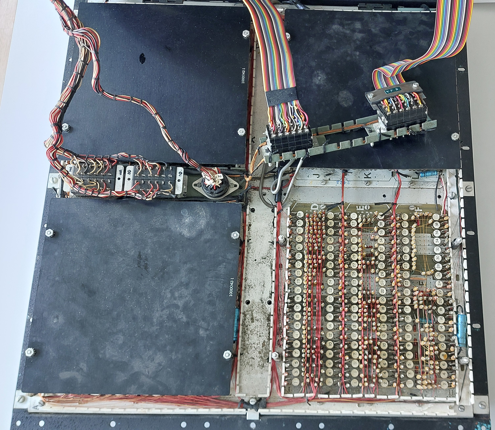
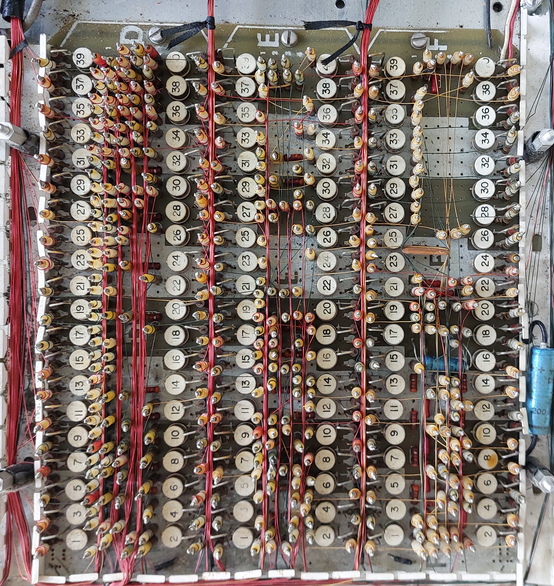
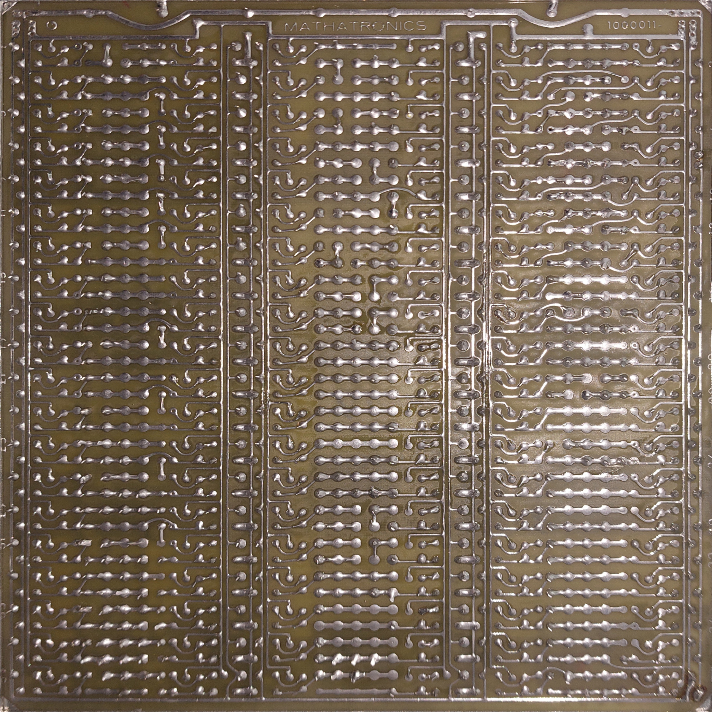
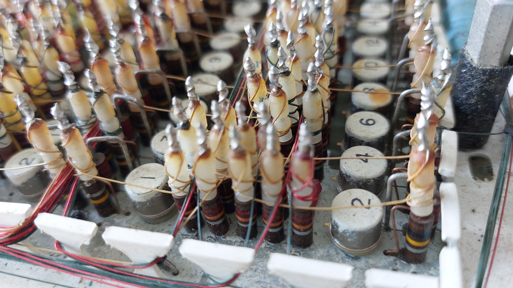
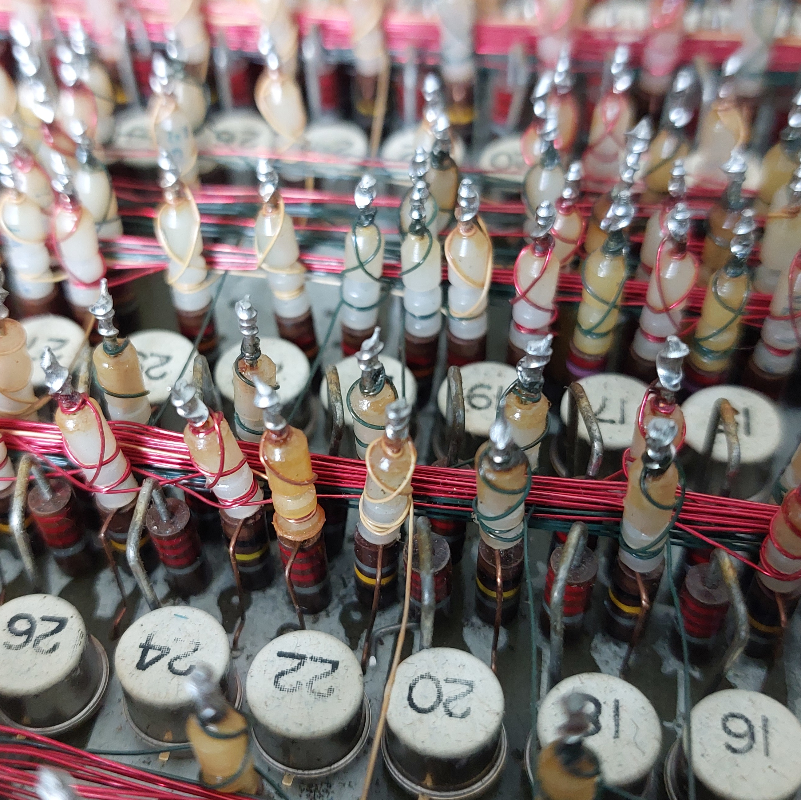
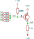
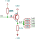
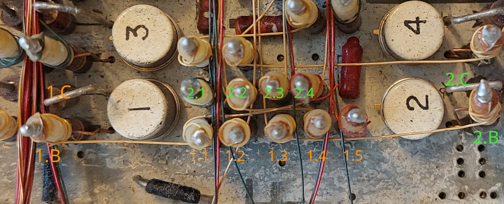

#### Physical structure

The logic is distributed across 8 PCBs containing 120 PNP transistors each. 4 of these PCBs are accessible when the
machine is opened. The other 4 are installed upside-down below them, making them inaccessible without either removing
the logic unit or opening the bottom of the machine. The top boards are mechanically protected by black plastic plates,
this is not the case for the upside-down boards. The back (solder) side of the boards is accessible by removing 9 screws
on the logic unit (4 corners, 4 sides, 1 in the center).  
Each board is divided into 3 "columns" of 40 transistors each. The columns are labeled `A`-`X` on the board silkscreen.
The structure of each column is symmetric: On the outside are the 100k base bias and 2.2k collector resistors. In the
center area of a column is a matrix with one row per transistor and up to five vertically mounted resistors per row.
Sometimes, this area also contains other components, mostly ceramic capacitors. The transistors[^1] are placed between
the matric and the base/collector resistors on either side. While both the front and back of the boards look very
regular at first glance, differences from the general structure of the traces are rather common.  
The logic unit is connected to the rest of the machine by multiple plugs. 3 plugs contain the data (read/write)
connections to the [core memory](./memory.md), one connects to the keyboard (and an external control interface), and one
connects to "everything else", mostly the power supply, core drivers and printer.

Entire logic unit            |  Single board                  |Reverse side
:---------------------------:|:------------------------------:|:-----------------------------------:
|   |

Only a small fraction of the connections within the logic unit is realized by traces on the PCBs. Instead, the PCBs
contain many vertically mounted resistors. The bottom terminal is connected to a trace on the PCB, while the top contact
is connected to various other similar resistors on the PCB using magnet wire. The magnet wire is connected to the
resistor using a solder joint on top of a [patented](./patents/US3502787-bobbin.pdf) bobbin. Four different colors of
magnet wire are used: "plain" copper, yellow, green, and red. It is likely that the colors have some meaning, either
indicating the type of signal (e.g. control vs data path), or the length of the connection. However, the only color
where I have found a meaning so far are the plain copper wires, which are only used for signals connecting the logic
unit to other parts of the Mathatron through plugs.

Small part of logic unit        |  Magnet wire colors
:------------------------------:|:------------------------------:
|   

#### Circuit structure

The logic is primarily constructed from NOR gates, following the schematic below:

Unfortunately, in the physical construction the components of such a NOR gate are not located together. Instead, each
row contains the output stage (100k resistor and everything right of it) of one gate and the input resistors of the
following gates:

This makes it essentially impossible to reliably find all inputs of a gate: The `INT` signals are realized by magnet
wire and essentially impossible to follow. It is not even easily possible to determine whether one has found all input
signals of a gate. Another consequence is that the magnet wire does not contain a signal with sensible logic levels.
Instead, logic signals need to be probed directly at the collector resistor of Q1.

The picture below shows the numbering scheme I use for locations in the logic unit, which probably mostly matches the
one historically used by Mathatronics. The labels always refer to the signal on the top contact of the corresponding
resistor. The base of transistor `T` and the output of the corresponding NOR gate are referred to as `T.B` and `T.C`
(collector). The input resistors of the "next" NOR gate are labeled `T.1` to `T.5`, some of which might not be present.
If some of them are not populated, the indices follow the grid, e.g. only `T.1` and `T.4` might exist for some
transistors. When the column is clear from the context, `T` is simply the painted number on the transistor (`14.3`),
otherwise the column letter is included as a prefix (`F14.3`).

In some cases, the structure deviates from that described above. The simplest deviation is an "AC-coupled input" to a
NOR gate, i.e. an input that is `1` briefly when the previous stage switches from `0` to `1`. This is used e.g. in
counters/T-flip-flops.

#### Reverse engineering

Tracing the magnet wire connections visually (as usually done on PCBs) is essentially impossible for anything more
complex than very short local connections. Instead, everything has to be traced using continuity testing. Continuity
testing runs into two issues.

The first is that the solder joints on top of the resistors are typically sufficiently corroded so that standard
multimeter probes do not make contact. Placing probes on opposite sides of the same joint often does not show
continuity, and applying additional pressure to pierce through the oxide layer with probes is not possible due to the
mechanical construction. The most practical alternative I have found is to always use aligator clips to contact the
solder joints. This is much slower than a quick touch with a multimeter probe, but works very reliably while minimizing
the risk of mechanical damage to the circuit.

The second problem is more interesting: Which connections should be checked for continuity? For those parts of the
boards following the standard row/NOR layout, there is a good answer: The top contact of a "center" resistor should be
connected to exactly one base resistor. Most connections are likely to be "short"/"local", so it is reasonable to start
by looking for connections within a column. This can be done in 1-2 hours per column by checking for continuity from
each "center" resistor to each base connection using the same wire color in the same column. This information can then
be used, together with any "special" PCB structures in the column, to obtain an incomplete list of inputs to each NOR
gate, and a list of outputs to unknown other gates. It is also possible to generate a SPICE netlist to verify
behavior.  
For some columns, e.g. [column `F`](./printer-logic.md), this is enough to follow most of the logic. For other columns,
e.g. `D` and `E`, it does not give much useful information. These columns contain many rows not following the usual
structure, and also many NOR gates with (presumably) inputs from other columns. They also do not contain any connections
to known external signals[^2]. I have not found a reasonable way to trace these inter-column connections yet. I also do
not know how to trace efficiently trace connections in areas that do not follow the usual row structure, and therefore
are not necessarily connected to a base resistor.

#### Utilities and files

The data for the columns I have measured and some utility scripts can be found in [`logic-data`](./logic-data). The
scripts operate on the data for a single columns, which is a directory with the following files. `column-f` is the most
complete example of these files.
- `nets.txt`: This encodes the main connectivity information. Each line has the form `<dotname> <base>`. `dotname` is a
    reference to one of the resistors in the "grid" of the column (e.g. `14.4`). `base` is the index of the BJT to whose
    base this signal is connected (e.g. `3`). For grid positions where a resistor is present, but the base it connects
    to is unknown, `base` is replaced by `?<color>`, e.g. `?green`. The color refers to the magnet wire connected to the
    resistor. If no resistor is present in a grid position, the line is omitted from the file.
- `names.txt`: This files indicates known names for signals, for easier analysis. Each line has the form `<id>=<name>`.
    E.g. `13=bit4` indicates that the collector signal of transistor 13 should be called `bit4`.
- `special-ccs.txt`: This file encodes regions where the traces on the circuit board deviate from the usual row pattern.
    Each row specifies to one connected component, by listing all grid positions that are part of this component as a
    space-separated list. If the last entry of this list is a grid position, the name for the connected component will
    be generated automatically. If the name has the form `base(i)`, the grid positions will be considered as connected
    to the base of transistor `i`. Otherwise, the last entry will be used as the name for the component directly.
- `components.json`: This file lists any additional components placed in the column (primarily capacitors). The file
    should be an array of JSON objects, each of which encodes one "type" of component (e.g. 33 nF capacitors). These
    objects should contain 3 entries:
  - `namePrefix`: The name for the components will be this string followed by an index. This also indicates the
      component type to SPICE.
  - `connections`: An array of array of strings. Each entry of the outer array lists the pin positions of one "instance"
      of the component type, using grid position notation.
  - `lineSuffix`: Any additional information that should be added to the line in a SPICE file. E.g. the capacitence
      value of a capacitor.

[^1]: All transistors are  germanium PNP transistors. The exact transistor model may have varied between different
    Mathatron machines: Some sources, both contemporary and modern, claim that 2N404 were used. On the other hand, both
    the Arithmeum machine and the machine shown
    [here](https://neuron.eng.wayne.edu/auth/Calculators/Mathatron%208-48%20Hassoun/) use Texas Instruments GA2464
    transistors, for which I have not been able to find a datasheet.
[^2]: Column `F` connects to the [printer position sensor](./printer.md), which gives a clear entry point for
    understanding the purpose of the logic.
