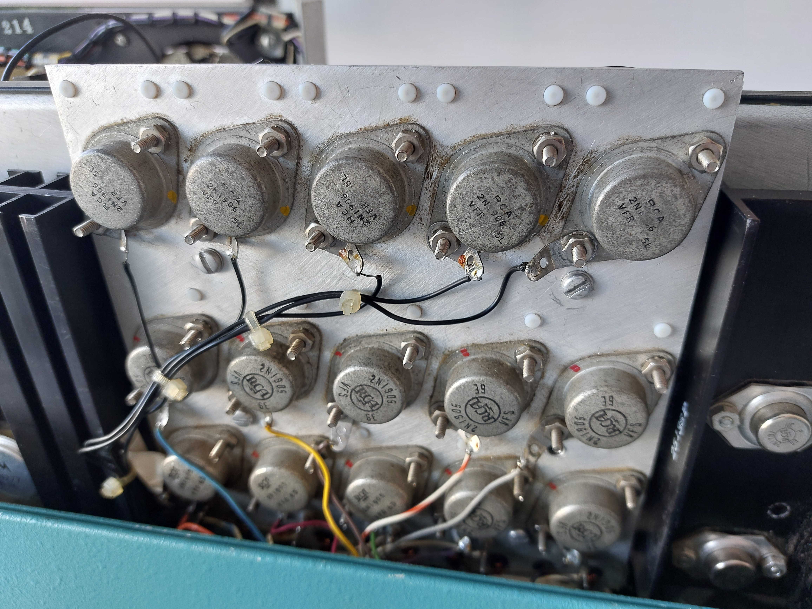
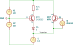

The core drivers can be divided into roughly 3 sections: Those at a positive voltage relative to the core windings
("top"), those at a negative voltage relative to them ("bottom"), and the parts that cross from top to bottom. These
include the core windings themselves, but also some other "side" circuits. The most positive voltage is around 40V,
while the most negative is -10V. At a high level, the top section connects the correct drive lines to +40V. The other
end of the drive lines are connected to one of three constant current sinks in the bottom section, one for the main
drive and one for each of the two copies of the auxiliary driver. The additional side circuits ensure that the current
is at the drive current even between pulses, presumably to reduce supply voltage variation.

### Top side

The top side is formed by the "15-BJT-board" (see [construction](./construction.md)). The top row of PNP BJTs (2N1906)
select the main drive line, while the lower two rows (2N1905) correspond to the two copies of the auxiliary driver[^1].
In addition to the BJTs, there are various components mounted on the back of the board, as well as 10 small pulse
transformers in the bottom edge of the board. The 3 transistors arranged as a column correspond to the same "phase" of
the core driver. The first pulse is in the rightmost column, then the columns are activated one by one from left to
right.  
A pulse on one of the five shift lines is triggered by pulling a logic-level input (0 to -10V) low for 10µs, the
duration of a pulse on the main driver. The logic input is connected to the base of the corresponding main drive PNP
through a 1µF electrolytic capacitor, used to obtain a pulse relative to the 40V emitter voltage instead of 0V. Before
the collector wire enters the memory core, it passes through four pulse transformers at the edge of the board (single
turn each). Two of these cause the corresponding auxiliary drive transistors to turn on. After about 6 µs, the cores of
these transformers saturate, ending the auxiliary pulses[^2]. The windings in the other two transformers (the ones used
to drive BJTs during the previous pulse) are polarized such that they do not turn on the connected PNP transistors, they
only serve to reset the magnetization state of the cores. The order of the transformers along the board edge matches the
BJT columns.  
Some of the auxiliary drive transistors have a low-value resistor (3.9 Ohms in parallel with 6.81 Ohms) connected in
series with the drive transformer. There does not seem to be a pattern to which of them have the resistor and which ones
do not. I suspect that the resistor is supposed to be present for either all of them or one of the two rows, but that
this was accidentally changed in an earlier attempted repair on the Arithmeum machine: Some of these precisely-chosen
resistors are connected between DC rails, and they use a newer style of resistor than the rest of the machine.

Front                        |  Back                         |Transformers
:---------------------------:|:-----------------------------:|:-----------------------------------:
|   |

### Bottom side

The bottom side of each of the three drivers (one main, two auxiliary) consists of a simple switched current sink as
shown below. Before the start of an operation (i.e. after a button is pressed), `Enable` switches from -10V to 0V. The
voltage at the upper end of the resistor will be roughly one diode drop below 0V, essentially independent of the voltage
at the input (collector of Q1). This results in a roughly constant current through the resistor, and hence also a
constant current at the input.  
For the two auxiliary drivers, Q1 is one of the 2N1701 (smaller package) on the right heatsink. The current setting
resistors are in the top left corner of the "mixed board" and consist of a 15 Ohm resistor in parallel with another
resistor. In the Arithmeum machine this additional resistor is 91 Ohm for one driver and 68 Ohm for the other, so this
was probably used to fine-tune each of the drivers.  
The current sink for the main driver is also split across two transistors and setting resistors, probably due to the
high total current required (1.5A). These are the larger 2N2338 on the same heatsink. The setting resistors are the
variable resistors at the back of the resistor cage. For these current sinks, the base voltage (`Enable`) is not driven
to 0V but to the voltage of the "extra cap cable" (see [power supply section](./power-supply.md)). This corresponds to
roughly -4V, but uses some variety of active regulation.

### Side load

To keep the supply voltage stable, the current draw should be as constant as possible throughout the memory cycle. For
the main driver this is generally fulfilled automatically since the pulse on one phase ends when the pulse on the next
phase starts. For the auxiliary drivers, where the pulses are shorter, this is implemented explicitly using the circuit
below: `Q17` and `I2` represent the current path through the actual core memory, `I1` is the current sink described
above.  
During a memory current pulse, `Q17` is saturated, pulling `Vcenter` close to +40V. As a result, the emitter voltage of
`Q16` is positive and, since the base is connected to ground, no current flows in this path. Since the maximum
emitter-to-base voltage for `2N3053` is 5V, `D6` is used to take up most of the voltage drop[^3].  
Outside of a memory pulse, the current through `Q17` is zero. As a result, `Vcenter` moves to roughly -1.4V,
corresponding to the diode drops across the base/emitter junction of `Q16` and `D6`. The current path is now through
`R24`, `Q16` and `D6`. Most of the voltage drop is across `R24`, a power resistor found in the "resistor cage".

[^1]:  The common datasheet for both transitors can be found
    [here](https://w140.com/tekwiki/images/1/1e/Rca_2n1905_datasheet.pdf).
[^2]: This also implies that modifying the drive current of the main driver will change the pulse duration of the
    auxiliary driver, since the cores will saturate earlier/later.
[^3]: The actual emitter voltage of `Q16` will be determined by the reverse leakages of `D6` and the base/emitter
    junction of `Q16`. The resulting voltage is likely either beyond the 5V rating or very close to it, causing these
    transistors to fail. In the Arithmeum machine, this transistor had failed in both copies of the circuit, though with
    different symptoms.
