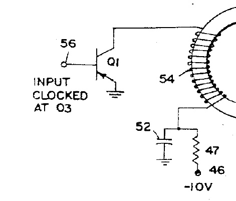
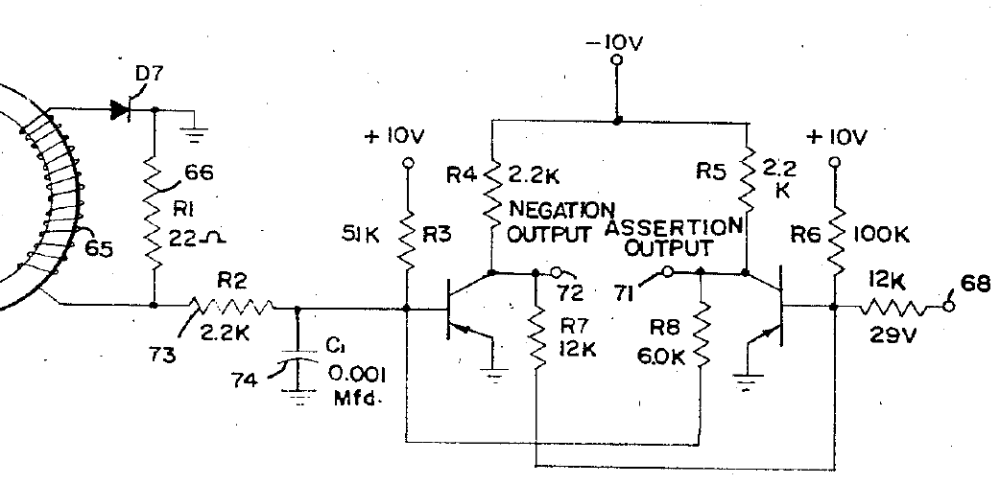

This sections describes the data connections to the core memory. The read and write circuits seem to match those in [the
patent](./patents/US3438011-shift-register.pdf): The write circuit discharges a small capacitor (50 nF) through the
coil, the read circuit consists of an impedance matching stage followed by a simple RS-latch. The RS-latch is somewhat
biased towards the input from the core since this has a lower signal level than a general logic pulse. Some (all?) of
the write circuits are located in column A, the read circuits are likely located on the lower boards.

Write circuit:  

Read circuit:  

#### Connection to the processor

The connectors from the processor to the memory are located on the left half of the logic unit. In the Arithmeum
machine, there are three connectors in total: Two "rectangular" connectors labeled "1" and "2", and an additional "tube
socket" type connector. Most wires on these connectors are red or white, with a few additional black wires.  
The general convention on the rectangular connectors seems to be that black wires are only used for ground connections.
Red wires carry signals coming from the memory (read), and white wires carry signals from the processor to the memory
(write). This also makes sense as an easy-to-remember mnemonic: *red* is *read*, *white* is *write*. There are a few
exceptions to this rule, as some white wires also carry power signals to the "memory interface board". The rectangular
connectors contain a total of 18 red and 20 white wires. Two of the white wires are placed "apart from the rest" and
carry power connections. While the program storage register is logically a 192-bit register, it is most likely
implemented as 4 separate 48-bit registers. This would ensure that shifting all registers 48 times does not affect
memory content. Under this assumption, the 18 read/write pairs correspond exactly to the 14 data registers (A, B, R1-R4,
S1-S8) plus the 4 sub-registers of the program storage register.  
The single black wire on the tube socket also seems to be a ground connection. However, the other wires are most likely
all read connections despite alternating between red and white: There are only 18 capacitors for generating write pulses
on the memory interface board. Additionally, adding additional write points to the memory would be a complex task. On
the other hand, adding additional read points to the memory is simple since the read circuit (without the 22R loading
resistor) presents a high impedence. It would be very hard to implement the algorithms used by the Mathatron without
additional read points, especially 4 bits from the end of the A, B, and R1 registers: These registers are combined
arithmetically, so the processor needs to read a full 4-bit digit from them before having to write the "new" version of
the same digit. The algorithms also make use of shifts to the right, which again require access to the second-to-last
digit.

#### Probing

Both read and write signals can be easily probed on the rectangular connectors. For write signals (white wires), the
"default state" is -10 V, with exponentially decaying pulses to 0V on a timescale of about 10 µs. I am not sure at this
point whether these pulses correspond to logical 1s or logical 0s in the register. A logic analyzer with a threshold of
-5 V gives reasonably clean signals. Read signals (red wires) have much lower signal levels, but can also be probed
without any special considerations on signal integrity: Unlike traditional core memory, this style of core memory
provides a multi-100mV pulse on read outputs.
