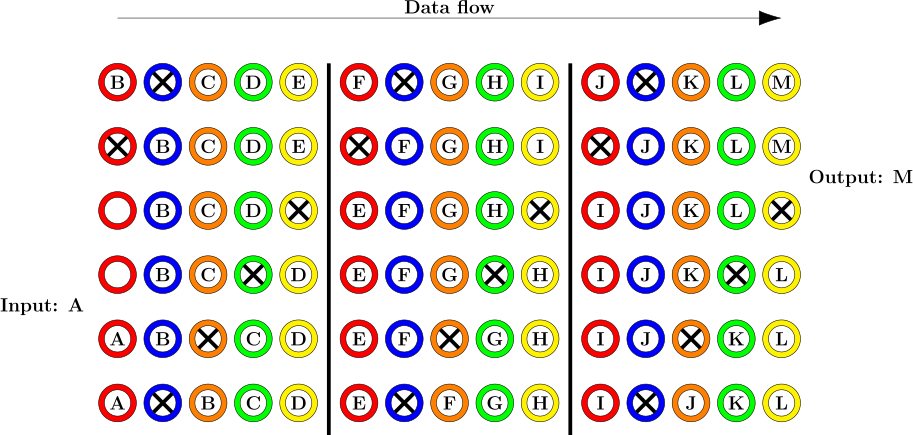
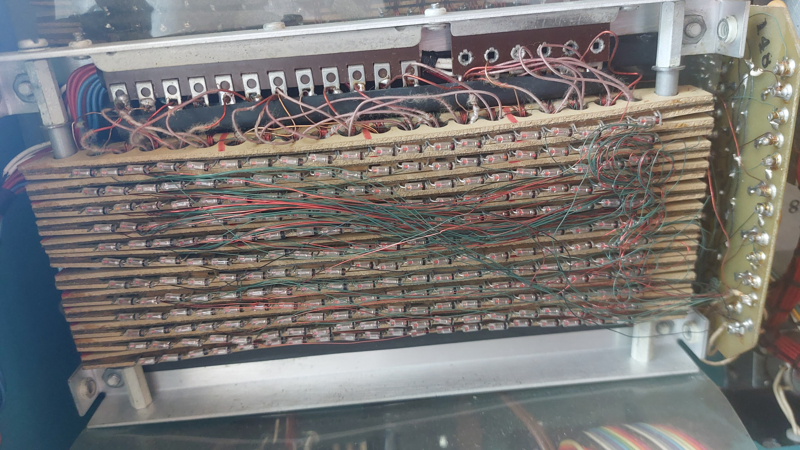

> This section describes the high-level operation of the memory. Details on the main and auxiliary pulse drivers are
> described in the section on [memory drivers](./memory-driver.md), while details of the memory data connections can
> be found under [memory signals](./memory-signals.md).

The Mathatron uses an unusual type of core memory as its main memory described in US patent US3438011: The cores are
used to implement a shift register, or rather multiple shift registers. Data is still stored by the core magnetization
state at one bit per core, but some additional cores are needed to handle the shifting. Additionally, the cores are much
larger than in typical (coincident-current) core memory, with an outer diameter of 6-7 mm. The shift register is divided
into segments of `n` cores along its length (`n=5` for the Mathatron). At all times one of the `n` cores in each segment
is "empty" in the sense that its magnetization state is not part of the memory content. The position of this empty core
is the same in each segment at the same time, and its state always corresponds to a logical 0. A drive "phase" consists
of moving the content of the core before the empty core into the empty core in each segment. After `n` phases, a single
bit is extracted from the shift register.

The picture below shows a 12-bit shift register, using 5 phases like the Mathatron memory. Data is fed into the register
on the left, and read from it on the right. The cores are colored by their phase. At the start, all cores except for the
blue ones contain data bits (letters). A single drive phase moves the contents of the red cores into the blue ones, now
leaving the red cores empty. In the next phase, data is shifted from the yellow cores to the red ones. This phase is
special because the first core of the shift register is red, and the last core is yellow. The contents of the first core
are simply cleared, leaving it available for data to be written to it in one of the following phases[^1]. The contents
of the last core are transfered into a read circuit (essentially a flip-flop), which makes the data bit `M` available to
the processor. After three more drive phases, the last row of the image shows the register in the same state as at the
start, but with all bits shifted by one position to the right.

The shifting is implemented by passing a current through windings[^2] on both the core being shifted from and the core
being shifted into (the "empty" core) at the same time. The pulse through the core being shifted from is known as the
"main" pulse, while the pulse through the core being shifted into is known as the "auxiliary" pulse. Both pulses are
strong enough to flip the magnetic state of the cores, but the auxiliary pulse is only "barely" strong enough. To pass
information from the first core to the second, there is a 5-turn "output winding" on the first core connected to a
single-turn "input winding" on the second core. If the first core flips, a current pulse is induced in the output
winding and through that in the input winding. This pulse is opposed to the auxiliary pulse and it strong enough to
prevent the second core from flipping. If the first core does not flip, no current is induced and the second core flips
from the auxiliary pulse.

To prevent a flip of the second core (in the next phase) from flipping the first core through this output/input winding,
the windings are connected by a diode. The voltage induced in the single-turn input coil by a flip of the second core is
smaller than the forward voltage of the diode, so cannot affect the first core.

The polarity of the main pulse corresponds to setting a core to 0. Since the auxiliary pulse needs to flip the
previously empty (hence logical 0) core if not opposed by the input/output pulse, its polarity sets cores to 1. This
implies that shifting involves an inversion: If the core being shifted from was previously set to 0, it does not flip,
no current is induced, and the empty core is set to 1. If the core being shifted from was previously set to 1, it flips,
induces a current, and prevents the empty core from flipping from its 0 state. For simplicity, this is ignored in the
image above.

In some cases, it is necessary for the logic to have access to the "next" digit in memory: If e.g. two numbers are
added, their last decimal digit would normally shift out of the core memory (bit by bit) during the same period as the
last digit of the result is shifted into the core memory. Since the digits need to be fully known to compute the bits of
the result, this would not be possible with "pure" shift registers. Instead, an additional output measurement coil is
installed on the core 4 bits (5 cores) from the usual output core. This provides the "next" digit to the processor,
allowing it to compute (in the example) the summed digit before it has to entered into memory. In some cases, some cores
are physically missing from a register, presumably for similar reasons.

### Physical construction

The memory is divided into rows of 20 cores each, using the wiring scheme suggested in figure 10 in the patent. Each row
is manufactured as a separate module. In the Mathatron 8-48 at the Arithmeum, there are approximately 40 modules in the
larger section on the back (only partially accessible) and 12 modules in the smaller section at the front. Since the
shift register uses 5 cores for 4 stored bits, each row corresponds to 16 bits and each 48 bit register consists of 3
rows.

The drive wires are threaded through the entire core, with the starting point at the top of the front core section.
Below the core sections, the wires simply pass from each core "column" of the front section into the corresponding
column in the back section. At the top of the back section, the wires are threaded back into the corresponding column of
the next section of the module. Since the direction of the drive wires reverses between sections, the polarity of the
input/output windings of the modules also reverses at each section boundary.

The auxiliary drive is split into two identical copies of the same driver circuit for unknown reasons. The first two
segments of each module are driven by one of these, the remaining two segments are driven by the other. The main drive
is not split in this manner, and drives all segments of all modules.

The main and auxiliary driver circuits are reasonably accessible and described in [this section](./memory-driver.md).
Unfortunately, the data in- and output circuits and especially their connections to the core are not. This makes the
organization of the memory into logical registers a guess. The front section is likely the program storage for both
pre-wired and user-provided programs (see below). The back section probably consists of either 39 or 42 modules,
corresponding to 13 or 14 48-bit registers. This roughly matches the patent: 8 S-registers for user programs, 4
R-registers for handling parathesis, and A and B registers for intermediate results. This corresponds to 14 registers
overall. On the right end, a wire connects the last contacts of every third row. This contact probably corresponds to
the last (or possibly first) bit of a register, where data is inserted/extracted.

Missing cores                        |  Register connections                    |
:-----------------------------------:|:----------------------------------------:|
|   |

#### Pre-wired programs

Mathatron provided multiple "pre-wired" programs with each machine, which allowed common programs to be entered with a
single keypress. This is probably achieved by threading one wire per pre-wired program through the entire program
storage. When a current pulse is applied to this wire, all cores of the program storage are simultaneously set to the
correct value for the respective pre-wired program. I have not been able to confirm this directly, but there are
strong arguments in favor of this theory:
- There is no "large" memory in the machine besides the main core memory (no core rope or similar). The pre-wired
    programs have to be stored somewhere, and a wire passing through all relevant cores provides this storage in a
    cheap and compact form.
- Storing and entering the pre-wired programs in this manner minimizes the amount of extra circuitry needed to support
    them: Entering a program means sending a single current pulse through a wire not used for any other purpose, while
    executing a pre-wired program is indistinguishable from executing a user-provided program and therefore does not
    need any extra hardware. The program selection knob seems to directly select between such wires. The actual
    processor does not have to be modified in any way to support pre-wired programs.
- The front section of the memory has a large amount of "random" thin wires going through it. I do not have access to
    the reverse of the back section of the memory, but the "randomness" of these wires suggests that they may be used to
    implement the programs. Additionally, the memory of the front section (12 rows of 16 bits) corresponds exactly to
    the 192 bits needed to store 48 4-bit program steps.
- The wiring of the selector and the ENTER button for pre-wired programs: The ENTER button is a SPDT switch, that
    normally charges a small electrolytic capacitor (connected to the common contact) through a resistor. When pressed,
    this capacitor is connected to "some wires in the core" through the program selector.
- There is some suggestion that the front section of the memory can be replaced with relatively little work, which
    matches the fact that Mathatronics offered to install pre-wired programs in existing machines.
- The main Mathatron patent (US3996562) mentions that the pre-wired programs (in particular the square root program) are
    stored in the same memory as the user program.

[^1]: It does not matter during which phase the input is written to the core, as long as it happens before the next
    phase shifting from red to blue.
[^2]: These are single-turn windings, using a wire passing straight through all cores of a phase.
