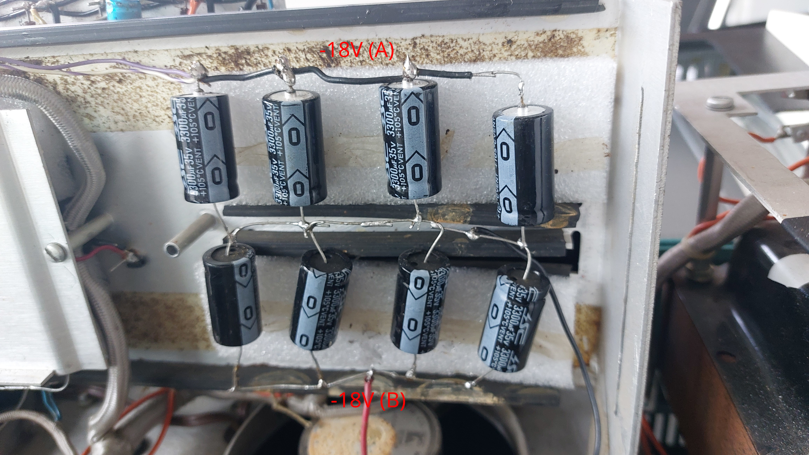

#### Filter capacitors

The filter capacitors have been replaced in the Arithmeum machine, so this information should be taken with a grain of
salt.  
The left set of capacitors consists of 1000µF capacitors, while the right section uses 3300µF capacitors. With the
exception of the top right capacitor of the left section, all center connections are to ground.

##### Connections in the left section

-45V (A): Used for the printer, rectified by two diodes on the mixed board.

-45V (B): Used for BJT base bias, rectified by a single diode on the mixed board.

+45V (A): Directly after half-wave rectification, not used for anything

+45V (B): After smoothing by a large inductor (transformer-like, inside the main chassis), forming a pi-network with the
capacitors for +45V (A).

+10V: This is primarily used for base bias in the main logic unit. It seems to be derived from +40V (B) by a dropping
resistor, without any regulation.

-10V: This is derived using some sort of regulation from the -18V rails in the right capacitor section. The positive
(inner) end of one of these capacitors is not connected to ground, but to a different net referred to as the "extra cap
cable" in some schematics.

##### Connections in the right section

TODO work out A vs B

#### Other circuits

The higher-current rails are rectified using stud-mounted diodes in front of the "mixed board". The lower-current rails
use generic axial-lead diodes mounted on the mixed board itself. There are two additional high-power (stud-mounted)
diodes on the mixed board itself. In the Arithmeum machine one of them is mounted on a heatsink, but this appears to be
a late modification: [This](http://www.calcuseum.com/SCRAPBOOK/BITMAP/BONUS/75987/_SMD75990_XL.htm) picture shows the
internals of the same machine before it was acquired by the Arithmeum. The right stud-mounted diode is still mounted
directly to the board, but the board is already discolored around it (indicating high power dissipation). This is
confusing since, from my measurements, this diode should only conduct when the +10V rail drops below 0V. At the same
time, this seems to be a realistic scenario since the original design included a high-power diode. The other high-power
diode prevents the "extra cap cable" from becoming more negative than the -10V rail.

One of the more confusing parts of the Mathatron is (what I assume to be) the regulation circuit of the -10V rail. This
is the main voltage used in the logic unit, so it is at the same time a high-current supply and needs to be reasonably
stable under uneven current (processor activity). However, the regulator "feeds" the -10V rail depending on the voltage
of the "extra cap cable", and tends to reduce the current when the voltage drops rather than increasing it (both in
simulation and measurements). The circuit can be found in the `PSU` sheet of the KiCAD project in the `schematics`
folder. As usual, since this is based on reverse engineering, it is likely to contain mistakes.
