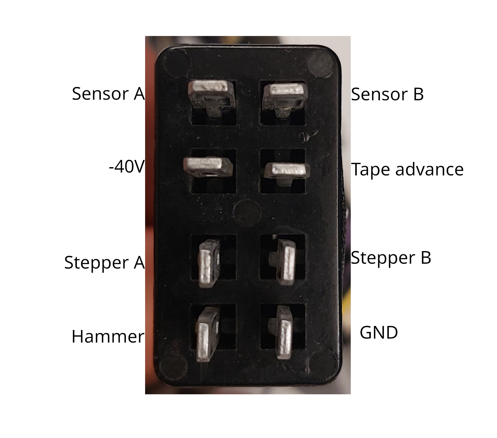
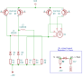

The printer unit is described at a high level in patent [US3304858](./patents/US3304858-printer.pdf). The printer is
built as a very independent unit and can easily be removed: First remove the top cover of the Mathatron. Unplug the
printer unit (one plug, just left of the printer) and remove the two screws at the front attaching it to the blue
chassis. The printer can then simply be lifted out of the machine. Running the machine with the printer unit removed
will not work well even for measurements, since it will try to align the print wheel when the first digit is entered.

## Operation

The printer consists of a type wheel (A) with 20 positions. The position of the wheel is controlled by a stepper motor
(E). Printing is achieved by a hammer (B) below the paper pushing it against the type wheel, with the ink ribbon in
between. After printing, both the tape and the ribbon are advanced by a common solenoid (F). Additionally, the printer
contains a magnetic sensor (C) to detect the position of the print wheel.

Usually, the tape is held quite tightly between two rollers. To manually pull out the tape, use lever (D) to release
the lower roller. This can also be used to pull back the tape during testing, or to feed a new tape into the printer.

## Electronics

Above is the pinout of the plug connecting the printer to the main unit. The control signals to the printer are
connected directly to the base of one of the 2N1540/1541 transistors (Germanium PNP). They are connected to the actual
logic input through a diode, with a pullup to +40V. The pullup and the diode are located on the "mixed board".  
The timing does not match the patent (column 5, lines 53-65). It is not clear whether this is an issue of this
particular machine, a difference between different generations of Mathatronics calculcators, or simply incorrect data in
the patent. The wheel advances by one character (1/20th of a full turn) every 5ms (instead of the 2.5ms claimed in the
patent).

The sensor is an inductive sensor triggered by a magnet in the character wheel. The sensor produces a pulse of roughly
300mV on a timescale of a few milliseconds when the magnet passes the sensor at the speed produced by the motor. One end
of it is connected to ground through a separate wire, connected to ground at the logic unit[^1]. The other end is
connected directly to the base of a transistor in the logic unit, see [here](./printer-logic.md).

[^1]: Presumably to avoid IR drop along the logic supply connection from drowning out the weak signal.
