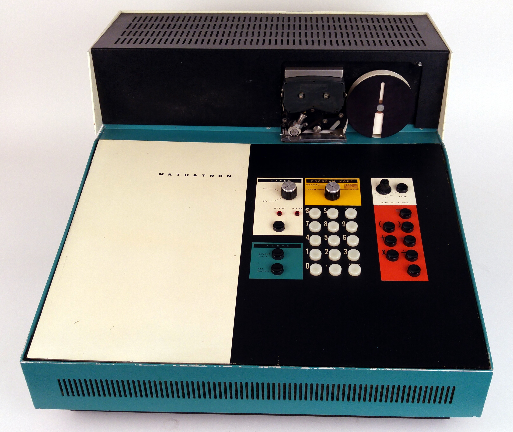
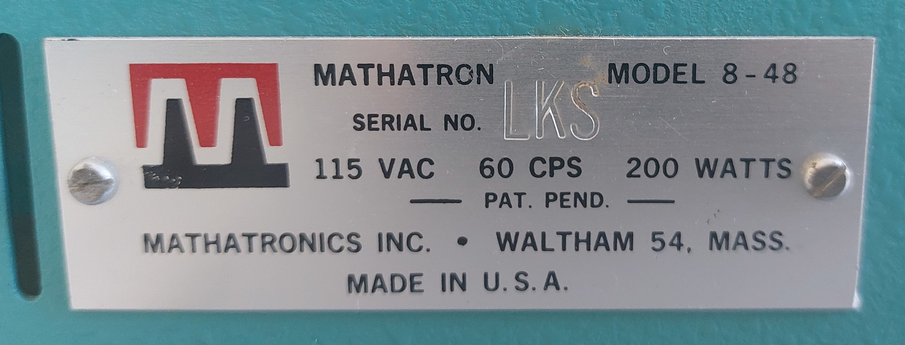

# The Mathatronics Mathatron calculator

The Mathatronics Mathatron calculator was the first programmable desk calculator, and also one of the first solid state
desk calculators[^1]. First sold in 1963, it was introduced just two years after the Anita Mk 7/8, the first
all-electronic desk calculator. The Anita was essentially an electronic implementation of a comptometer with automatic
multiplication and division. Compared to this, the Mathatron represents a major step forward: It allows expressions to
be entered using standard mathematical notation, including parenthesis, and evaluates them automatically, respecting
operator precedence[^2]. Programs could consist of 24 steps and use 4 number registers (in the original Mathatron 4-24),
and up to 48 steps and 8 registers in the later 4-48 model. Numbers were stored in a (binary-coded decimal!) floating
point format, with 8-9 significant decimal digits in the mantissa.

The history of Mathatronics and the development of the Mathatron calculator has been described in more detail in
multiple places, for example [here](https://www.oldcalculatormuseum.com/c-math8-48m.html) and
[here](http://calcmuseum.classiccmp.org//Mathatron_main.htm). On the other hand, very little technical information is
available: Except for some [patents](./patents.md), the only contemporary sources are some news articles and
advertisements, and I have not been able to find any existing attempt at reverse engineering at least parts of the
machine.

### This repository

In April 2024, I got access to the Mathatron 8-48 owned by the [Arithmeum](https://www.arithmeum.uni-bonn.de/) in
Bonn[^3]. Originally, this was an attempt to get it back to working order. After it slowly became clear that this was
not feasible, I decided to collect my notes in a form that may be useful to owners of other Mathatron calculators. While
some of the information is very technical and unlikely to be of interest to anyone without a Mathatron machine, much of
it is also of general interest as an example of the "lost" ideas used in machines of this era. For example, the [main
memory](./memory.md) consists of a type of magnetic core shift register[^4] that has (to my knowledge) not been used in
any other machines.

Disclaimer: While the Mathatron used in the creation of this repository is owned by the Arithmeum, the Arithmeum has had
no control over the contents of this repository.

### The Mathatron at the Arithmeum

The machine I used for this repository was acquired by the Arithmeum in an auction in 2017. The previous owner had
already done some restorations/repairs on it, for example replacing the main filter capacitors. In some cases, it is not
clear when a repair/change was done, the main reason they stand out as repairs is the newer style of resistor used. The
machine was operational[^5] a few years ago, but broke down repeatedly. Previous breakdowns were apparently easily
fixable (power supply issues), but the most recent breakdown is more complex with most likely at least two faults in the
processor logic.

The machine seems to be a special model manufactured for the [United States Bureau of Medical
Services](https://en.wikipedia.org/wiki/Bureau_of_Medical_Services). Since the BMS was dissolved at the end of the year
1966, this suggests that the machine was manufactured before that date. The official Mathatron model plate has `LKS`
stamped in place of the serial number found on other machines, while the BMS inventory label carries the numbers `62537`
and `#565`. Since these do not match the format used in other Mathatron serial numbers, they are presumably BMS-internal
inventory numbers. `LKS` could either be a generic code indicating a custom-order machine without a serial number, or it
could be a description of the features of the machine. For example, `S` is the type number suffix used for machines with
prewired programs for statistical applications, which is the set of prewired programs present in this machine.

Mathatron plate                  |  BMS plate
:-------------------------------:|:-----------------------------:
|  

### Contact

If you have any additional information on the Mathatron, want to ask a question about information not covered in this
repository, or want to suggest a correction, please get in touch with me. You can either [open an
issue](https://github.com/malte0811/Mathatron-docs/issues/new) in this repository, contact me on Discord (`malte0811`),
or by email using either the address listed on my Github account or `schuerks@or.uni-bonn.de`.

[^1]: The Friden EC 130 was developed around the same time, and depending on the cutoff date (first prototype, first
    public demonstration, first sale, etc) the Friden or the Mathatron is first.
[^2]: I.e. `1 + 2 * 3` is evaluated to `7` instead of `9`. In this regard, it is more advanced than modern cheap
    calculators.
[^3]: While I am not technically employed by the Arithmeum, I work at the Research Institute of Discrete Mathematics of
    the university of Bonn, which has close ties to the Arithmeum.
[^4]: Coincident-current core memory is fairly well-known at this point, but there were many attempts of other
    topologies of magnetic core memory. The memory used in the Mathatron is only one example of these.
[^5]: In the sense of being able to evaluate simple expressions. I do not know whether parentheses were tested, and I am
    quite sure that automatic program evaluation was not tested.
